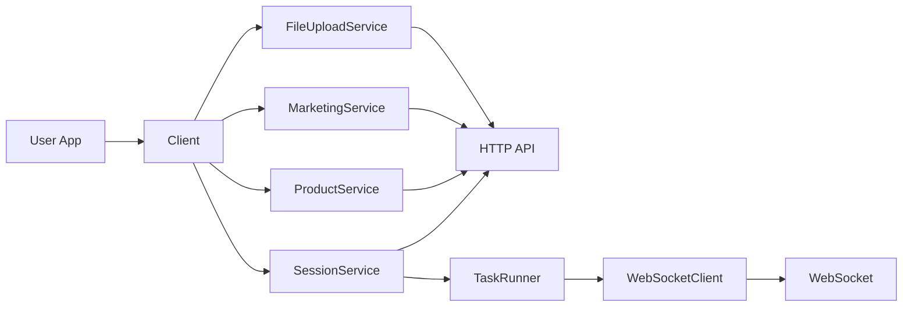

# AGENTS Guide

AI agent guidance for `octoevo`. See `README.md` for user-facing docs.

## How To Use

This SDK supports two independent modes and they should be used separately.

1. Install: `pip install octoevo`
2. Configure `mate.yaml` with `api_key` or `jwt_token`：

```yaml
   mate:
     api_key: "your-api-key"
     # or jwt_token: "your-jwt-token"
     base_url: "https://api.octoevo.ai"
     timeout: 30
   ```
3. Initialize client:


```python
from octoevo.mate import Client
from octoevo.mate.config import load_config

client = Client(load_config("mate.yaml"))
```

4. Pick one mode below.

### Marketing Mode

Use this mode for interactive generation loops (tweet/reply/like/retweet) over WebSocket sessions.

```python
from octoevo.mate import Client, create_task_runner
from octoevo.mate.config import load_config
from octoevo.mate.models import CreateSessionRequest
from octoevo.mate.task_runner import TaskExecutionOptions, TaskMode
from octoevo.mate.websocket import WebSocketClient

client = Client(load_config("mate.yaml"))
req = CreateSessionRequest(task="Create launch tweets", mode="marketing", platform="api", extra={})
session = client.session.create(req)
session_info = client.session.get_info(session.session_id)

ws = WebSocketClient(
    base_url=client.base_url,
    api_key=client.api_key or "",
    jwt_token=client.jwt_token or "",
    session_id=session_info.session_id,
)
runner = create_task_runner(ws, client, session_info)
runner.run_interactive_session(
    initial_task="Generate 3 tweet drafts",
    task_mode=TaskMode.Marketing,
    extra=req.extra,
    options=TaskExecutionOptions(verbose=True),
)
```

Example: [Marketing Example](examples/getting_started/example.py)

### Product Analysis Mode

Use this mode for create-product, polling, and report retrieval over HTTP APIs.

```python
from octoevo.mate import Client
from octoevo.mate.config import load_config

client = Client(load_config("mate.yaml"))
report = client.product.create_and_wait(product="Notion")
print(report.report_id, report.product_name)
```

Example: [Product Analysis Example](examples/product_analysis/example.py)

## Repository Structure

```text
.
├── README.md                  # Main user-facing documentation (English)
├── README_cn.md               # Main user-facing documentation (Chinese)
├── installation.md            # Installation guide (English)
├── installation_cn.md         # Installation guide (Chinese)
├── docs/                      # Protocol and API docs
├── examples/                  # Runnable examples and quick-start docs
└── octoevo/                   # Python package source
    ├── __init__.py            # Package entry
    └── mate/                  # Core SDK module
        ├── client.py          # Top-level client and service wiring
        ├── config.py          # Config loading and parsing
        ├── constants.py       # Shared protocol/API constants
        ├── errors.py          # Exception types
        ├── factory.py         # TaskRunner factory helpers
        ├── models.py          # Request/response models
        ├── plan.py            # Plan-related models
        ├── task_runner.py     # Interactive and automated task execution
        ├── websocket.py       # WebSocket transport client
        └── services/          # Domain services (session/product/marketing/etc.)
```

## Architecture



## Key Features

- HTTP + WebSocket session workflow
- Dual authentication (`api_key` and `jwt_token`)
- Interactive and automated execution via `TaskRunner`
- Product analysis flow (`create`, `poll`, `report`, `create_and_wait`)
- Marketing session and dashboard APIs
- File upload APIs for attachment-based workflows

## Versioning

- Package version is defined in `pyproject.toml` (`[project].version`).