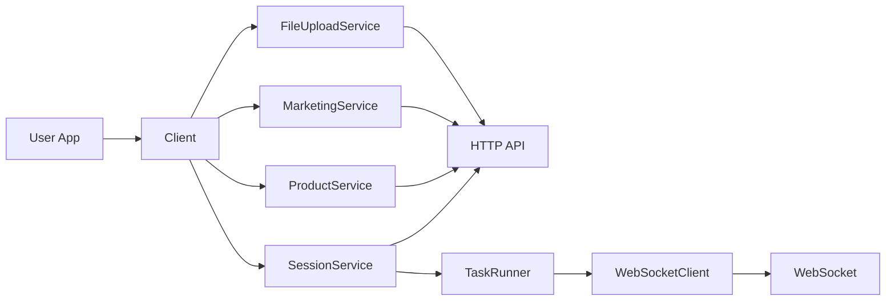

[English](README.md) | [中文](README_cn.md)

# WyseOS SDK for Python

Official Python SDK for WyseOS session protocol and real-time task execution.

## Highlights

- HTTP + WebSocket workflow aligned with `docs/wyse-session-protocol.md`
- `CreateSessionRequest(task, mode, platform, extra)`
- API Key and JWT dual authentication
- `TaskRunner` for automated and interactive execution
- Product analysis: create product, poll status, get report (`ProductService`)
- Marketing rich-stream support (`marketing_tweet_reply`, `marketing_tweet_interact`, `writer_twitter`)
- Marketing data APIs and dashboard APIs

## Architecture



## Repository Structure

`__pycache__` directories are runtime artifacts and are omitted below.

```text
wyseos
├── __init__.py                 # Package entry
└── mate                        # Core SDK module
    ├── __init__.py             # Public module exports
    ├── client.py               # Top-level client and service wiring
    ├── config.py               # Config loading and parsing
    ├── constants.py            # Shared protocol/API constants
    ├── errors.py               # SDK exception definitions
    ├── factory.py              # Client/task-runner constructors
    ├── models.py               # Request/response data models
    ├── plan.py                 # Plan-related message models
    ├── services                # Domain service layer
    │   ├── __init__.py         # Service exports
    │   ├── agent.py            # Agent APIs
    │   ├── browser.py          # Browser APIs
    │   ├── file_upload.py      # File upload and validation APIs
    │   ├── marketing.py        # Marketing dashboard APIs
    │   ├── product.py          # Product analysis APIs
    │   ├── session.py          # Session lifecycle and message APIs
    │   ├── team.py             # Team APIs
    │   └── user.py             # User and API key APIs
    ├── task_runner.py          # Automated/interactive task execution loop
    └── websocket.py            # WebSocket transport client
```

## Installation

```bash
pip install wyseos-sdk
```

See full install guide: `installation.md`.

## Quick Start

```python
from wyseos.mate import Client, ClientOptions, create_task_runner
from wyseos.mate.models import CreateSessionRequest
from wyseos.mate.task_runner import TaskExecutionOptions, TaskMode
from wyseos.mate.websocket import WebSocketClient

# 1) Initialize client
client = Client(ClientOptions(
    api_key="your-api-key",             # or jwt_token="your-jwt-token" (pick one)
    base_url="https://api.wyseos.com",  # required
    timeout=30,                         # optional, default 30s
))

# 2) Create session (latest protocol fields)
req = CreateSessionRequest(
    task="Draft a Twitter launch campaign for my product",
    mode="marketing",
    platform="api",
    extra={"marketing_product": {"product_id": "prod_123"}},
)
session = client.session.create(req)
session_info = client.session.get_info(session.session_id)

# 3) Connect websocket + task runner
ws_client = WebSocketClient(
    base_url=client.base_url,
    api_key=client.api_key or "",
    jwt_token=client.jwt_token or "",
    session_id=session_info.session_id,
)
task_runner = create_task_runner(ws_client, client, session_info)

# 4) Execute interactive session (recommended for marketing input loops)
task_runner.run_interactive_session(
    initial_task="Generate 3 tweet drafts and 5 candidate replies",
    task_mode=TaskMode.Marketing,
    extra=req.extra,
    options=TaskExecutionOptions(
        auto_accept_plan=False,
        verbose=True,
        stop_on_x_confirm=True,
        completion_timeout=600,
    ),
)
```

More examples: `examples/quickstart.md` and `examples/getting_started/example.py`.

## Product Analysis

Create a product, poll until analysis completes, and get the full report — no WebSocket needed.

```python
from wyseos.mate import Client, ClientOptions

client = Client(ClientOptions(
    api_key="your-api-key",
    base_url="https://api.wyseos.com",
))

report = client.product.create_and_wait(
    product="Notion",                       # product name or URL
    on_poll=lambda attempt, status: print(f"[{attempt}] {status}"),
)

print(report.product_name)
print(report.target_description)
print(report.keywords)
print(report.competitors)
print(report.user_personas)
print(report.recommended_campaigns)
```

Lower-level methods are also available:

```python
from wyseos.mate.models import CreateProductRequest

# Step 1: create
created = client.product.create(CreateProductRequest(product="Notion"))

# Step 2: poll
info = client.product.get_info(created.product_id)

# Step 3: get report
report = client.product.get_report(info.analysis_result.report_id)

# Optional: industry categories
categories = client.product.get_categories()
```

Full example: `examples/product_analysis/example.py`.

## Authentication

Use one of the following in `ClientOptions` / `mate.yaml`:

- `api_key`
- `jwt_token`

Behavior:

- HTTP:
  - `api_key` -> `x-api-key`
  - `jwt_token` -> `Authorization`
- WebSocket URL query:
  - `?api_key=...`
  - `?authorization=...`

## Session Protocol Flow

Typical flow:

1. `client.session.create(...)` to get `session_id`
2. Connect `WebSocketClient`
3. Send `start`
4. Receive `plan / input / progress / rich / text`
5. Receive `task_result`
6. Optionally receive `follow_up_suggestion`

For full message schema and rich types, see `docs/wyse-session-protocol.md`.

## Task Runner API

`TaskRunner` is created via:

```python
task_runner = create_task_runner(ws_client, client, session_info)
```

Main methods:

- `run_task(task, attachments=None, task_mode=TaskMode.Default, extra=None, options=None) -> TaskResult`
- `run_interactive_session(initial_task, attachments=None, task_mode=TaskMode.Default, extra=None, options=None)`

`TaskExecutionOptions` includes:

- `verbose` (default: `False`) — print status/progress to stdout
- `auto_accept_plan` — auto-approve plan without user input
- `capture_screenshots`
- `stop_on_x_confirm` — stop session when browser confirmation is requested (useful in CLI)
- `completion_timeout`

## Marketing APIs

Session-scoped generated content:

```python
client.session.get_marketing_data(session_id, type="reply")
client.session.get_marketing_data(session_id, type="like")
client.session.get_marketing_data(session_id, type="retweet")
client.session.get_marketing_data(session_id, type="tweet")
```

Dashboard APIs:

```python
client.marketing.get_product_info(product_id)
client.marketing.get_report_detail(report_id)
client.marketing.update_report(report_id, data)
client.marketing.get_research_tweets(query_id)
```

## Services Overview

- `client.user` - API keys
- `client.team` - team list/info
- `client.agent` - agent list/info
- `client.session` - create/info/messages/marketing data
- `client.browser` - browser APIs
- `client.file_upload` - upload and validation
- `client.product` - product analysis (create/poll/report/categories)
- `client.marketing` - dashboard marketing APIs

## Error Types

- `APIError`
- `NetworkError`
- `WebSocketError`
- `ConfigError`
- `SessionExecutionError`

## Documentation

- Session Protocol: `docs/wyse-session-protocol.md`
- Product API: `docs/api-product-create.md`
- Quick Start: `examples/quickstart.md`
- Installation: `installation.md`
- Marketing Example: `examples/getting_started/example.py`
- Product Analysis Example: `examples/product_analysis/example.py`
