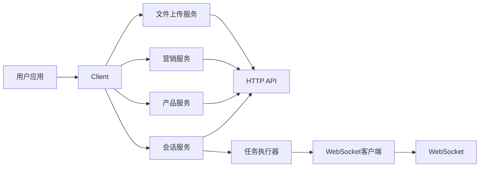

[English](README.md) | [中文](README_cn.md)

# OctoEvo Python SDK

OctoEvo 会话协议与实时任务执行的 Python SDK。

## 功能亮点

- 与 `docs/wyse-session-protocol.md` 对齐的 HTTP + WebSocket 工作流
- `CreateSessionRequest(task, mode, platform, extra)`
- API Key 与 JWT 双认证
- 用于自动化与交互式执行的 `TaskRunner`
- 产品分析：创建产品、轮询状态、获取报告（`ProductService`）
- 营销流支持（`marketing_tweet_reply`、`marketing_tweet_interact`、`writer_twitter`）
- 营销数据 API 与看板 API

## 架构



## 仓库结构

`__pycache__` 目录是运行时产物，下面已省略。

```text
octoevo
├── __init__.py                 # 包入口
└── mate                        # SDK 核心模块
    ├── __init__.py             # 模块对外导出
    ├── client.py               # 顶层客户端与服务装配
    ├── config.py               # 配置加载与解析
    ├── constants.py            # 协议/API 共享常量
    ├── errors.py               # SDK 异常定义
    ├── factory.py              # 客户端/任务执行器构建器
    ├── models.py               # 请求/响应数据模型
    ├── plan.py                 # 计划相关消息模型
    ├── services                # 领域服务层
    │   ├── __init__.py         # 服务导出
    │   ├── agent.py            # Agent 相关 API
    │   ├── browser.py          # 浏览器相关 API
    │   ├── file_upload.py      # 文件上传与校验 API
    │   ├── marketing.py        # 营销看板 API
    │   ├── product.py          # 产品分析 API
    │   ├── session.py          # 会话生命周期与消息 API
    │   ├── team.py             # 团队相关 API
    │   └── user.py             # 用户与 API Key 相关 API
    ├── task_runner.py          # 自动化/交互式任务执行循环
    └── websocket.py            # WebSocket 传输客户端
```

## 安装

```bash
pip install octoevo
```

完整安装说明见：`installation_cn.md`。

## 快速开始

```python
from octoevo.mate import Client, ClientOptions, create_task_runner
from octoevo.mate.models import CreateSessionRequest
from octoevo.mate.task_runner import TaskExecutionOptions, TaskMode
from octoevo.mate.websocket import WebSocketClient

# 1) 初始化客户端
client = Client(ClientOptions(
    api_key="your-api-key",             # or jwt_token="your-jwt-token" (pick one)
    base_url="https://api.dev.weclaw.ai",  # required
    timeout=30,                         # optional, default 30s
))

# 2) 创建会话（最新协议字段）
req = CreateSessionRequest(
    task="Draft a Twitter launch campaign for my product",
    mode="marketing",
    platform="api",
    extra={"marketing_product": {"product_id": "prod_123"}},
)
session = client.session.create(req)
session_info = client.session.get_info(session.session_id)

# 3) 连接 websocket + task runner
ws_client = WebSocketClient(
    base_url=client.base_url,
    api_key=client.api_key or "",
    jwt_token=client.jwt_token or "",
    session_id=session_info.session_id,
)
task_runner = create_task_runner(ws_client, client, session_info)

# 4) 执行交互式会话（推荐用于营销输入循环）
task_runner.run_interactive_session(
    initial_task="Generate 3 tweet drafts and 5 candidate replies",
    task_mode=TaskMode.Marketing,
    extra=req.extra,
    options=TaskExecutionOptions(
        auto_accept_plan=False,
        verbose=True,
        stop_on_x_confirm=True,
        completion_timeout=600,
    ),
)
```

更多示例：`examples/quickstart_cn.md` 与 `examples/getting_started/example.py`。

## 产品分析

创建产品，持续轮询直到分析完成，并获取完整报告，无需 WebSocket。

```python
from octoevo.mate import Client, ClientOptions

client = Client(ClientOptions(
    api_key="your-api-key",
    base_url="https://api.dev.weclaw.ai",
))

report = client.product.create_and_wait(
    product="Notion",                       # product name or URL
    on_poll=lambda attempt, status: print(f"[{attempt}] {status}"),
)

print(report.product_name)
print(report.target_description)
print(report.keywords)
print(report.competitors)
print(report.user_personas)
print(report.recommended_campaigns)
```

也可使用更底层的方法：

```python
from octoevo.mate.models import CreateProductRequest

# Step 1: create
created = client.product.create(CreateProductRequest(product="Notion"))

# Step 2: poll
info = client.product.get_info(created.product_id)

# Step 3: get report
report = client.product.get_report(info.analysis_result.report_id)

# Optional: industry categories
categories = client.product.get_categories()
```

完整示例：`examples/product_analysis/example.py`。

## 认证

在 `ClientOptions` / `mate.yaml` 中使用以下任一方式：

- `api_key`
- `jwt_token`

行为说明：

- HTTP:
  - `api_key` -> `x-api-key`
  - `jwt_token` -> `Authorization`
- WebSocket URL query:
  - `?api_key=...`
  - `?authorization=...`

## 会话协议流程

典型流程：

1. `client.session.create(...)` 获取 `session_id`
2. 连接 `WebSocketClient`
3. 发送 `start`
4. 接收 `plan / input / progress / rich / text`
5. 接收 `task_result`
6. 可选接收 `follow_up_suggestion`

完整消息结构与富类型见：`docs/wyse-session-protocol.md`。

## Task Runner API

`TaskRunner` 的创建方式：

```python
task_runner = create_task_runner(ws_client, client, session_info)
```

主要方法：

- `run_task(task, attachments=None, task_mode=TaskMode.Default, extra=None, options=None) -> TaskResult`
- `run_interactive_session(initial_task, attachments=None, task_mode=TaskMode.Default, extra=None, options=None)`

`TaskExecutionOptions` 包含：

- `verbose`（默认：`False`）- 输出状态/进度到 stdout
- `auto_accept_plan` - 自动批准计划，无需用户输入
- `capture_screenshots`
- `stop_on_x_confirm` - 当浏览器确认被请求时停止会话（CLI 场景常用）
- `completion_timeout`

## 营销 API

会话范围内的生成内容：

```python
client.session.get_marketing_data(session_id, type="reply")
client.session.get_marketing_data(session_id, type="like")
client.session.get_marketing_data(session_id, type="retweet")
client.session.get_marketing_data(session_id, type="tweet")
```

看板 API：

```python
client.marketing.get_product_info(product_id)
client.marketing.get_report_detail(report_id)
client.marketing.update_report(report_id, data)
client.marketing.get_research_tweets(query_id)
```

## 服务概览

- `client.user` - API keys
- `client.team` - 团队列表/信息
- `client.agent` - agent 列表/信息
- `client.session` - 创建/信息/消息/营销数据
- `client.browser` - 浏览器 API
- `client.file_upload` - 上传与校验
- `client.product` - 产品分析（创建/轮询/报告/分类）
- `client.marketing` - 看板营销 API

## 错误类型

- `APIError`
- `NetworkError`
- `WebSocketError`
- `ConfigError`
- `SessionExecutionError`

## 文档

- 会话协议：`docs/wyse-session-protocol.md`
- 产品 API：`docs/api-product-create.md`
- 快速开始：`examples/quickstart_cn.md`
- 安装：`installation_cn.md`
- 营销示例：`examples/getting_started/example.py`
- 产品分析示例：`examples/product_analysis/example.py`
